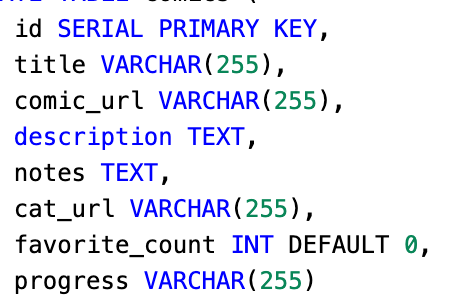
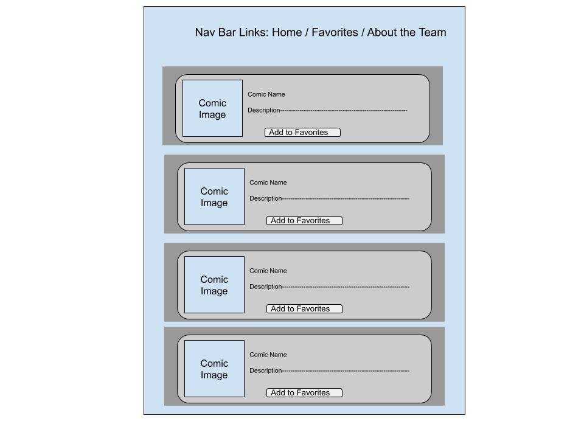
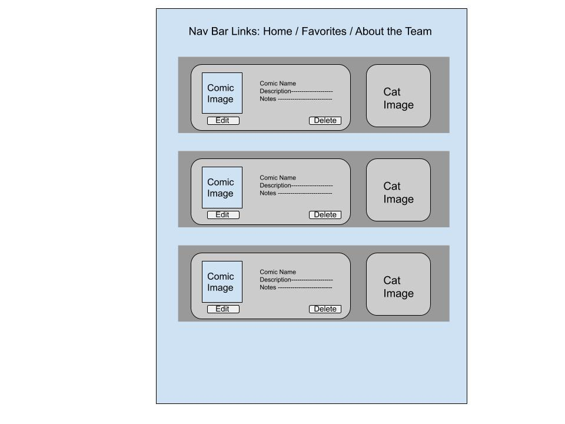
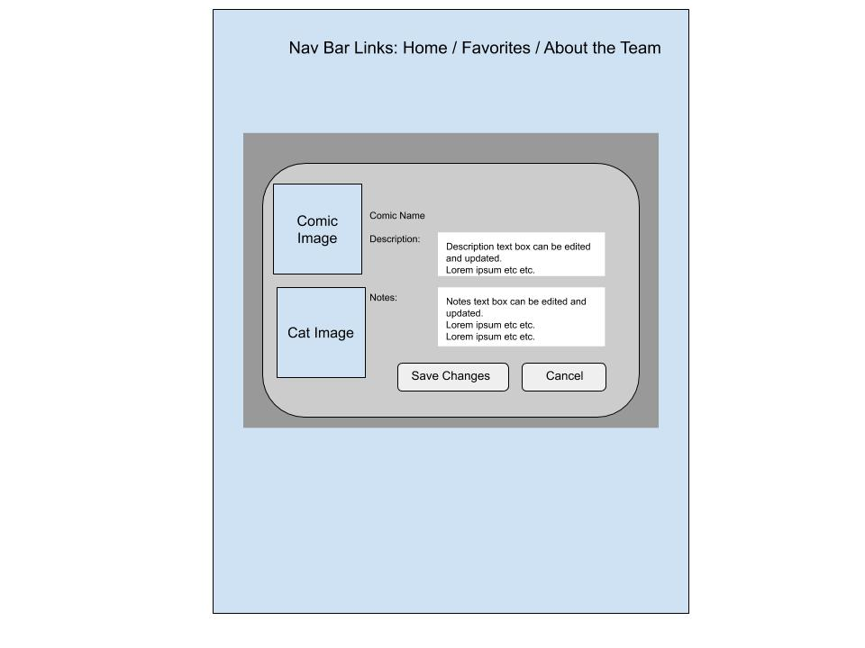
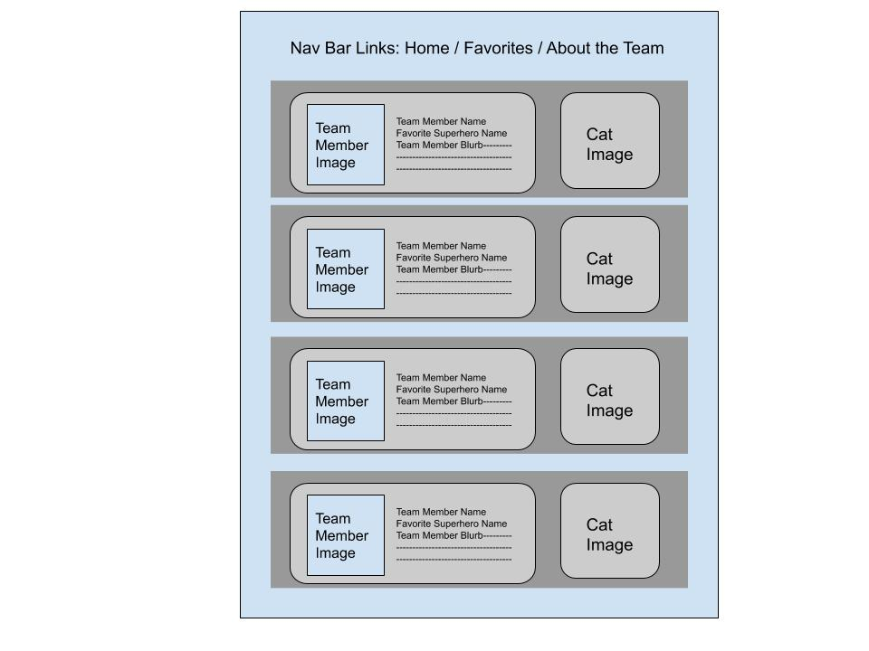

# Comic Cat
Find a comic, find a cat!

---

## Team POST

const Contributors =  [‘Jennifer Chinzi’ && ‘Paul O’Brien’ && ‘Joshua Beasley’ && Amber Falbo’]

---

### Problem Domain

Comic Cat was created to provide users an easy way to search through the Marvel API for specific titles, save those titles to the ‘Favorites’ Page, add notes, edit the provided description, *and* enjoy the fun surprise of a cat image paired with each saved comic.  
At its heart, this is a purr-fect way to track comics you love and comics you’d like to read.

[Trello](https://trello.com/b/NpwUtujB/team-post)

---

### Semantic Versioning

- 3.4.4 - Reading Progress feature added
- 3.3.4 - About page content updated
- 3.3.3 - Changes made to Schema file
- 3.2.3 - Content added to About page
- 3.2.2 - Counter Feature added
- 3.1.2 - Updates to favorites page
- 3.1.1 - Updates to the search results page 
- 3.1.1 - Cat Reroll Feature added
- 3.0.0 - Major CSS update to landing page, favorites page and edit page
- 2.5.0 - jQuery elements added
- 2.4.0 - Edit Page is live
- 2.3.0 - Add to Favorites Button is functional
- 2.2.0 - Delete Button is functional
- 2.1.0 - Favorites Page is live
- 2.0.0 - Landing Page and Links to several pages are live
- 1.3.0 - File Scaffolding
- 1.2.0 - Data Folder and Contents
- 1.1.0 -  Project Prep #4
- 1.0.0 - ReadMe and Paperwork (Project Prep 1-3)

---

### Libraries

- dotenv
- ejs
- superagent
- express
- md5
- method-override
- pg

---

### Installation Instructions

1. Clone down this repo
1. Install all necessary libraries
  
    - `npm install -S dotenv ejs express md5 method-override pg superagent` OR
    - `npm i`   
1. Create a .env file using the sampleenv file for reference 
    - Marvel API keys can be requested at https://developer.marvel.com/account
    - Cat API key can be requested at https://thecatapi.com/

1. Set up your database

    - Make sure you have psql installed
    - Set up a database and make sure it is referenced correctly in your .env file
    - `psql -d DATABASE_NAME -f SCHEMA_FILE_NAME`

1. Turn on your local server

    - `nodemon` 

---

### API Endpoints

**marvel.com**

/v1/public/comics

**thecatapi.com**

/v1/images/search

---

### Database Schema

---

### Documentation

Domain Modeling

Wire Frames

